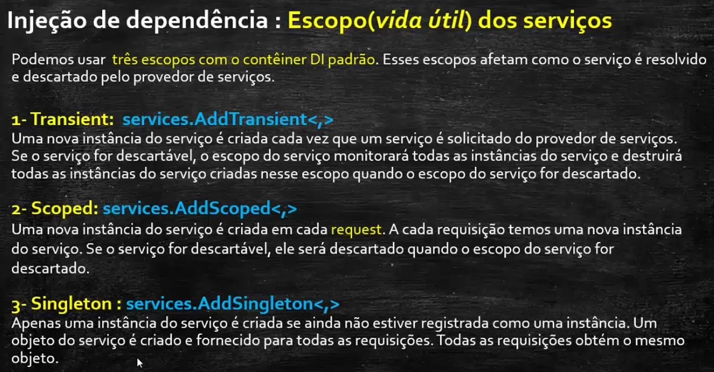

# ProjetoVendaLanches

Site para Venda de Lanches - ASP .NET Core MVC com .NET 7

## Descrição do projeto
Os principais conceitos da ASP .NET Core MVC aplicados na criação de um site para vendas de lanches funcional. Foi criado do zero um site web dinâmico com diversos conceitos relacionados ao desenvolvimento web usando a tecnologia ASP .NET Core MVC e o Entity Framework Core.

Vai mostar como implementar o padrão MVC, definir as entidades do modelo de domínio usando o Entity Framework Core, definir a validação e configuração das entidades usando o Data Annotations, realizar a migração para criar o banco de dados e as tabelas usando a abordagem Code-Frist, popular as tabelas do banco de dados, usar o padrão Repository e o padrão ViewModel, trabalhar com Session criando um carrinho de compras, Definir rotas na aplicação, usar as View Components no projeto, implementar a segurança usando a ASP .NET Core Identity criando o Login, o Registro e o Logout do usuário, criar e usar Partial Views,  realizar a paginação e filtro dos dados, criar relatórios usando consultas LINQ, criar gráficos usando o GoogleChart, criar relatórios no formato PDF usando o FastReport OpenSource.

## Apresentação do Projeto - Site para Vendas de Lanches

### Arquiteturas

### Certificados

### Relacionamentos de Tabelas do Banco de Dados

### Identity

### Fluxo

### Modelo de Domínio

### Entity Framework Core

### Injeção de dependência

### Padrão Repository

### View

### Roteamentto

